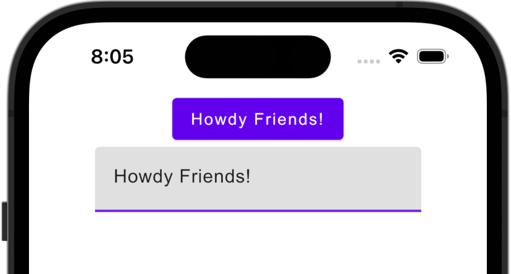

#### Running on a real device

You can run your Compose Multiplatform application on a real iOS device for free.
To do so, you'll need the following:

* The `TEAM_ID` associated with your [Apple ID](https://support.apple.com/en-us/HT204316)
* The iOS device registered in Xcode

> **Note**
> Before you continue, we suggest creating a simple "Hello, world!" project in Xcode to ensure you can successfully run apps on your device.
> You can follow the instructions below or watch this [Stanford CS193P lecture recording](https://youtu.be/bqu6BquVi2M?start=716&end=1399).

<details>
<summary>How to create and run a simple project in Xcode</summary>

1. On the Xcode welcome screen, select **Create a new project in Xcode**.
2. On the **iOS** tab, choose the **App** template. Click **Next**.
3. Specify the product name and keep other settings default. Click **Next**.
4. Select where to store the project on your computer and click **Create**. You'll see an app that displays "Hello, world!" on the device screen.
5. At the top of your Xcode screen, click on the device name near the **Run** button.
6. Plug your device into the computer. You'll see this device in the list of run options.
7. Choose your device and click **Run**.

</details>

##### Finding your Team ID

In the terminal, run `kdoctor --team-ids` to find your Team ID.
KDoctor will list all Team IDs currently configured on your system, for example:

```text
3ABC246XYZ (Max Sample)
ZABCW6SXYZ (SampleTech Inc.)
```

<details>
<summary>Alternative way to find your Team ID</summary>

If KDoctor doesn't work for you, try this alternative method:

1. In Android Studio, run the `iosApp` configuration with the selected real device. The build should fail.
2. Go to Xcode and select **Open a project or file**.
3. Navigate to the `iosApp/iosApp.xcworkspace` file of your project.
4. In the left-hand menu, select `iosApp`.
5. Navigate to **Signing & Capabilities**.
6. In the **Team** list, select your team.

If you haven't set up your team yet, use the **Add account** option and follow the steps.

</details>

To run the application, set the `TEAM_ID`:

1. In the template, navigate to the `iosApp/Configuration/Config.xcconfig` file.
2. Set your `TEAM_ID`.
3. Re-open the project in Android Studio. It should show the registered iOS device in the `iosApp` run configuration.

## Make your first changes

You can now make some changes in the code and check that they are visible in both the iOS and Android applications at the same time:

1. In Android Studio, navigate to the `shared/src/commonMain/kotlin/App.kt` file.
   This is the common entry point for your Compose Multiplatform app.

   Here, you see the code responsible for rendering the "Hello, World!" button and the animated Compose Multiplatform logo:

   ```kotlin
   @OptIn(ExperimentalResourceApi::class)
   @Composable
   fun App() {
       MaterialTheme {
           var greetingText by remember { mutableStateOf("Hello, World!") }
           var showImage by remember { mutableStateOf(false) }
           Column(Modifier.fillMaxWidth(), horizontalAlignment = Alignment.CenterHorizontally) {
               Button(onClick = {
                   greetingText = "Hello, ${getPlatformName()}"
                   showImage = !showImage
               }) {
                   Text(greetingText)
               }
               AnimatedVisibility(showImage) {
                   Image(
                       painterResource("compose-multiplatform.xml"),
                       null
                   )
               }
           }
       }
   }
   ```

2. Update the shared code by adding a text field that will update the name displayed on the button:

   ```diff
   @OptIn(ExperimentalResourceApi::class)
   @Composable
   fun App() {
       MaterialTheme {
           var greetingText by remember { mutableStateOf("Hello, World!") }
           var showImage by remember { mutableStateOf(false) }
           Column(Modifier.fillMaxWidth(), horizontalAlignment = Alignment.CenterHorizontally) {
               Button(onClick = {
                   greetingText = "Hello, ${getPlatformName()}"
                   showImage = !showImage
               }) {
                   Text(greetingText)
               }
   +           TextField(greetingText, onValueChange = { greetingText = it })
               AnimatedVisibility(showImage) {
                   Image(
                       painterResource("compose-multiplatform.xml"),
                       null
                   )
               }
           }
       }
   }
   ```

3. Re-run both the `androidApp` and `iosApp` configurations. You'll see this change reflected in both the Android and iOS apps:

   

## How to configure the iOS application

To get a better understanding of this template's setup and learn how to configure the basic properties of your iOS app without Xcode,
open the `iosApp/Configuration/Config.xcconfig` file in Android Studio. The configuration file contains:

* `APP_NAME`, a target executable and an application bundle name.
* `BUNDLE_ID`, which [uniquely identifies the app throughout the system](https://developer.apple.com/documentation/bundleresources/information_property_list/cfbundleidentifier#discussion).
* `TEAM_ID`, [a unique identifier generated by Apple that's assigned to your team](https://developer.apple.com/help/account/manage-your-team/locate-your-team-id/#:~:text=A%20Team%20ID%20is%20a,developer%20in%20App%20Store%20Connect).

To configure the `APP_NAME` option, open `Config.xcconfig` in any text editor *before opening* the project in Android Studio, and then set the desired name.

If you need to change this option after you open the project in Android Studio, do the following:

1. Close the project in Android Studio.
2. Run `./cleanup.sh` in your terminal.
3. Change the setting.
4. Open the project in Android Studio again.

To configure advanced settings, use Xcode. After opening the project in Android Studio,
open the `iosApp/iosApp.xcworkspace` file in Xcode and make changes there.

## Next steps

We encourage you to explore Compose Multiplatform further and try out more projects:

* [Learn about other cases for using the Compose Multiplatform UI framework](https://github.com/JetBrains/compose-multiplatform#readme)
* [Create an application targeting Windows, macOS, and Linux with Compose Multiplatform for Desktop](https://github.com/JetBrains/compose-multiplatform-desktop-template#readme)
* [Complete more Compose Multiplatform tutorials](https://github.com/JetBrains/compose-multiplatform/blob/master/tutorials/README.md)
* [Explore some more advanced Compose Multiplatform example projects](https://github.com/JetBrains/compose-multiplatform/blob/master/examples/README.md)
